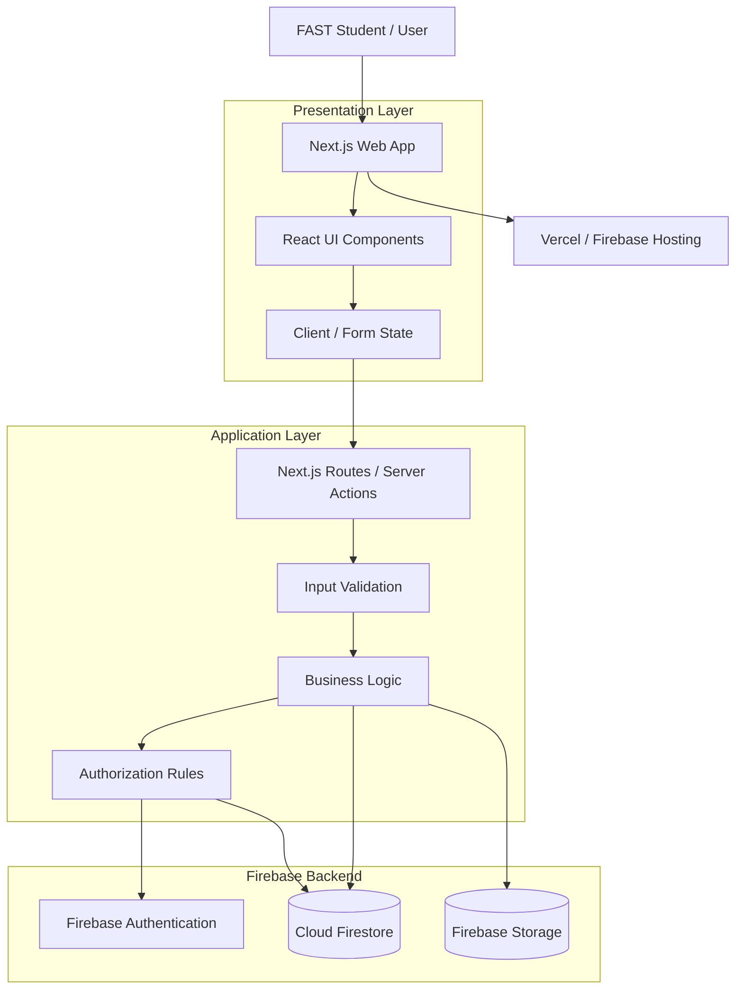
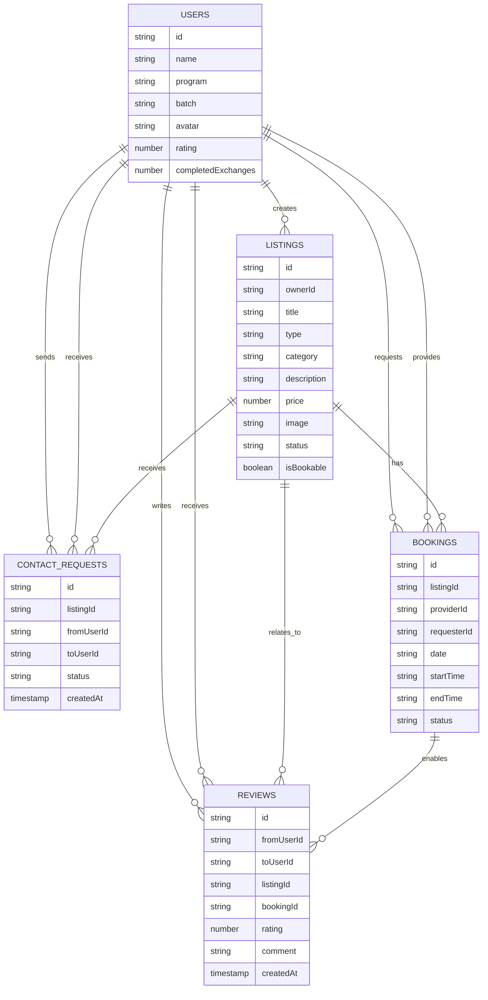
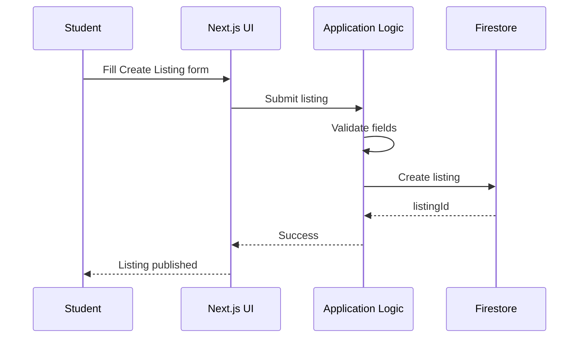
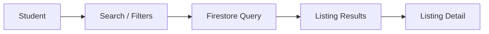
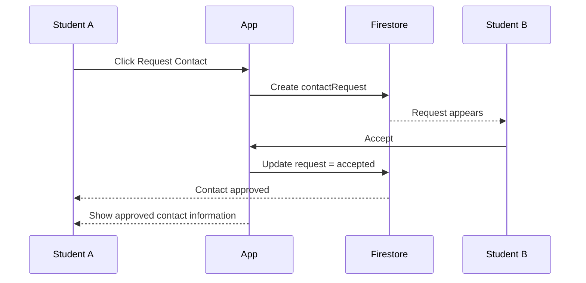
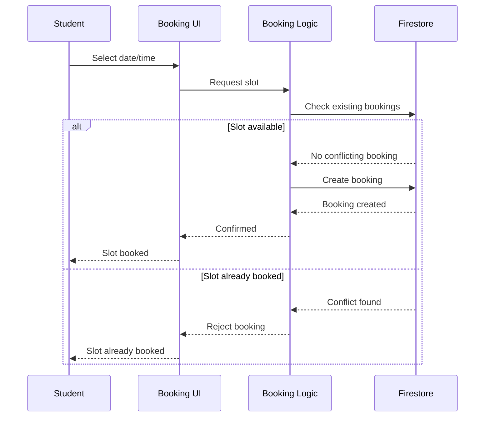
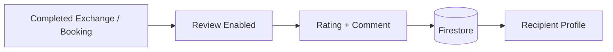
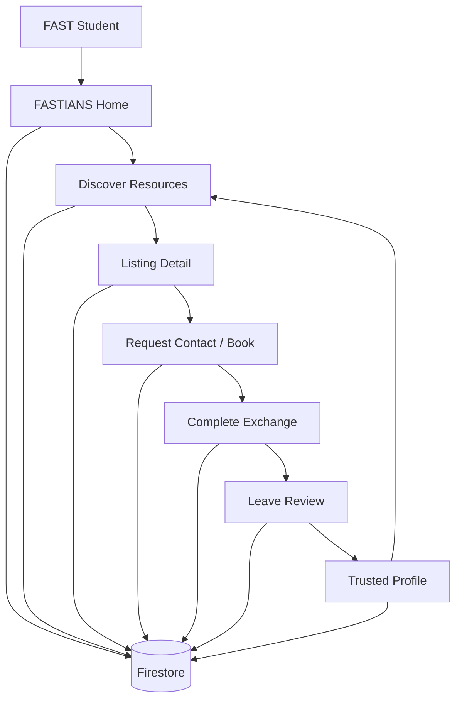

# FASTIANS — Technical Architecture & System Blueprint

> **Project:** FASTIANS
> **Purpose:** A trusted student exchange platform for FAST students
> **Architecture style:** Modern web app, serverless backend
> **Constraint:** 24-hour build — favors simplicity, clarity, and a complete end-to-end workflow over enterprise complexity

*(For product vision, positioning, and demo strategy, see the [product README](./README.md).)*

---

## 1. Architecture Goals

1. **Fast discovery** — find useful resources in seconds
2. **Trust** — users, exchanges, and reviews have visible history
3. **Correct booking** — unavailable slots must never be double-booked
4. **Simple exchange flow** — discover → request/book → connect → complete → review
5. **Hackathon speed** — minimum infrastructure, minimum moving parts

The system should feel like a community exchange, not a generic e-commerce platform.

---

## 2. High-Level Architecture



**Request path:** Student → Next.js UI → application logic → validation/authorization → Firestore/Storage → updated UI.

---

## 3. Stack

| Layer | Choice |
|---|---|
| Frontend | Next.js, React, Tailwind CSS, TypeScript |
| Backend | Firebase Authentication, Cloud Firestore, Firebase Storage |
| Deployment | Vercel or Firebase Hosting |

**Why serverless?** A 24-hour prototype shouldn't manage a custom backend server, a separate SQL server, infra deployment, or manual API scaling. This keeps the team focused on the product.

---

## 4. System Layers

**Presentation** — Pages: Home, Discover, Listing Detail, Create Listing, Booking, Requests, Dashboard, Profile.
Reusable components: `ListingCard`, `CategoryCard`, `SearchBar`, `FilterBar`, `UserTrustBadge`, `RatingStars`, `AvailabilityBadge`, `BookingSlot`, `ContactRequestCard`, `ReviewCard`, `EmptyState`.

**Application** — what makes FASTIANS more than a CRUD marketplace: validates listings and booking requests, prevents duplicate bookings, gates reviews on completion, verifies listing ownership, manages contact requests, updates exchange state, computes trust info.

**Data** — Firestore collections detailed below.

---

## 5. Data Model



### Firestore structure

```text
firestore
├── users/{userId}
├── listings/{listingId}
├── bookings/{bookingId}
├── contactRequests/{requestId}
└── reviews/{reviewId}
```

### Field notes & examples

**`/users/{userId}`** — powers profile, trust badge, listing owner info, reviews, exchange count.
```json
{ "name": "Haider Raza", "program": "Computer Science", "batch": "2026",
  "avatar": "/avatars/haider.png", "rating": 4.9, "completedExchanges": 14,
  "createdAt": "timestamp" }
```

**`/listings/{listingId}`** — `type`: `item | service | booking`. `status`: `active | reserved | completed | expired | cancelled`.
```json
{ "ownerId": "user_123", "title": "Programming Fundamentals Textbook",
  "type": "item", "category": "Books", "description": "Good condition PF textbook.",
  "price": 1500, "image": "/listing/pf-book.jpg", "status": "active",
  "isBookable": false, "createdAt": "timestamp" }
```

**`/bookings/{bookingId}`** — `status`: `requested | confirmed | completed | cancelled | declined`.
```json
{ "listingId": "listing_123", "providerId": "user_123", "requesterId": "user_456",
  "date": "2026-08-13", "startTime": "16:00", "endTime": "17:00",
  "status": "confirmed", "createdAt": "timestamp" }
```

**`/contactRequests/{requestId}`** — `pending → accepted → contact revealed → exchange completed`, or `pending → declined`.
```json
{ "listingId": "listing_123", "fromUserId": "user_456", "toUserId": "user_123",
  "status": "pending", "createdAt": "timestamp" }
```

**`/reviews/{reviewId}`** — `bookingId` is `null` for a non-booked item exchange; set for a completed booking.
```json
{ "fromUserId": "user_456", "toUserId": "user_123", "listingId": "listing_123",
  "bookingId": null, "rating": 5, "comment": "Exactly as described.",
  "createdAt": "timestamp" }
```

---

## 6. Core Business Flows

### A. Create Listing

Rules: title, category, and description required; price required only where applicable; bookable listings require availability data; owner must be identified.

### B. Search & Browse

Primary fields: keyword, category, type, price range, availability. Keep it fast and visually simple.

### C. Contact Request

The platform facilitates the connection — it does not need full messaging.

### D. Booking (with double-booking prevention)


**Invariant:** a confirmed booking must not overlap another confirmed booking for the same listing (same listing + same date + overlapping time = conflict).

**Overlap rule:** `newStart < existingEnd AND newEnd > existingStart`.
```text
Existing 4:00–5:00 PM, New 4:30–5:30 PM  → CONFLICT
Existing 4:00–5:00 PM, New 5:00–6:00 PM  → No overlap
```

For the prototype: check in application logic and disable already-booked slots in the UI. For production: make booking creation transaction-safe so simultaneous requests can't both claim a slot.

### E. Completion
```text
Item exchange:  Contact accepted → Students coordinate → Exchange occurs → Mark completed → Review unlocked
Booking:        Booking confirmed → Appointment occurs → Mark completed → Review unlocked
```
No pre-completion reviews allowed.

### F. Review

Rules: rating 1–5, comment optional, allowed only after completion, belongs to a recipient, avoid duplicate reviews for the same completed exchange.

**Trust score:** `average rating = sum of ratings / number of ratings` (e.g., 5+5+4+5+5 over 5 reviews = 4.8). Display as `★★★★★ 4.8 · 12 completed exchanges`. No complex reputation algorithm for the hackathon.

---

## 7. Security & Authorization

| Role | Can |
|---|---|
| Any user | Read public listings; create/edit/close own listings; create contact requests; view own requests; create/view own bookings; review eligible completed exchanges |
| Listing owner | Read requests for own listings; accept/decline requests; manage own listing |
| Other users | **Cannot** modify someone else's listing/profile/booking, forge reviews, or access private contact info before approval |

Conceptual Firestore rule flow: public → read active listings; authenticated user → create/modify own listing only; booking requester → create own booking; provider → manage bookings for own listings; review author → create own eligible review. **Never trust the client alone** — enforce business rules server-side / via Firestore security rules.

### Authentication strategy
The challenge doesn't require real login. Two viable options:
- **Demo-first (recommended):** a simple user selector — *"Continue as: Haider Raza / Ali Ahmed / Sara Khan"* — fastest for a controlled judging demo.
- **Firebase Authentication:** more realistic, but only if it won't delay the core workflow.

---

## 8. UI Architecture

**Home** — hero states the tagline, search bar, four category tiles, popular/recent listings. Should answer *"what is this?"* and *"what can I do here?"* within seconds.

**Discovery** — search, categories, filters, results (cards prioritizing: what it is → availability → offered by → trust → price).

**Listing Detail** — image, title, category, price/free, availability, description, provider (name, rating, completed exchanges, status), primary CTA (Request Contact or Book a Slot), optional Save/Share.

**Booking** — simple slot picker, not a full calendar:
```text
DSA Tutoring — Provider: Ali ★★★★★ 4.8
THURSDAY
10:00 AM  AVAILABLE   11:00 AM  BOOKED
12:00 PM  AVAILABLE   01:00 PM  AVAILABLE
[ Book Selected Slot ]
```

**Dashboard** — My Listings, My Bookings, Contact Requests, Completed Exchanges; actions: edit/close listing, accept/decline requests, cancel booking, mark completed, leave review.

**Navigation:** `HOME · DISCOVER · BOOKINGS · DASHBOARD · PROFILE`, with a persistent **+ Create Listing** CTA.

**Notifications:** no push notifications — simple in-app counters (`Requests (2)`, `Bookings (1)`).

**Mobile:** primary environment may be mobile despite being a web app — bottom nav or compact header, single-column cards, large touch targets. Critical mobile screens: Home, Search, Listing Detail, Booking, Dashboard.

**Optional (only after core workflow):** Saved listings (♡ Save), Share listing (copy URL).

---

## 9. State Machines

```text
Listing:          ACTIVE → RESERVED → COMPLETED | ACTIVE → EXPIRED | ACTIVE → CANCELLED
Contact Request:  PENDING → ACCEPTED | DECLINED
Booking:          REQUESTED → CONFIRMED → COMPLETED | CANCELLED  |  REQUESTED → DECLINED
Review:           LOCKED → ELIGIBLE → SUBMITTED
```

---

## 10. Edge Cases

| Case | UI response |
|---|---|
| No results | "No resources found. Try another keyword or category." |
| Empty listings | "You have not created any listings yet. [Create Listing]" |
| Booked slot | "This slot has already been booked. [View other available times]" |
| Expired listing | "This listing is no longer available." |
| Review before completion | "Complete the exchange before leaving a review." |
| Request pending | "Contact request pending." |

---

## 11. Opportunity Feed Logic

No AI required.
```text
score = recency + category relevance + availability + popularity
```
Or simpler still: `recent active listings + bookable available services + popular categories`. The bar is that it feels useful.

---

## 12. Performance

Paginate large listing collections if needed; avoid full-resolution images everywhere; debounce search input; cache common profile/listing data; keep Firestore reads intentional; avoid full-page refreshes after actions. Goal: feels instant.

---

## 13. Folder Structure & API Surface

```text
src/
├── app/
│   ├── page.tsx
│   ├── discover/page.tsx
│   ├── listings/[id]/page.tsx
│   ├── listings/new/page.tsx
│   ├── bookings/page.tsx
│   ├── requests/page.tsx
│   ├── dashboard/page.tsx
│   └── profile/[id]/page.tsx
├── components/{ui,listings,bookings,profile,common}/
├── lib/{firebase.ts, firestore.ts, validation.ts, booking.ts}
├── types/{user,listing,booking,request,review}.ts
└── data/seed.ts
```
(A recommendation, not a challenge requirement.)

**Core operations** — keep the surface small and clear:
```text
createListing() · getListings() · getListing() · updateListing()
createContactRequest() · acceptContactRequest() · declineContactRequest()
getAvailableSlots() · createBooking() · cancelBooking() · completeBooking()
completeExchange() · createReview() · getProfileReviews()
```

---

## 14. Demo Data

```text
USERS: Haider Raza, Ali Ahmed, Sara Khan, Ahmed Khan, Ayesha Malik
LISTINGS: PF Textbook, OOP Textbook, Scientific Calculator, DSA Tutoring, CV Review, React Mentorship
BOOKINGS: DSA session, CV review, React mentorship
REVIEWS: 5★ textbook exchange, 4★ tutoring review, 5★ CV review
```

---

## 15. 24-Hour Build Order

```text
1 Setup → 2 Home + Discover → 3 Listings CRUD → 4 Listing details → 5 Contact requests
→ 6 Booking engine → 7 Completion flow → 8 Reviews + profiles → 9 Edge cases
→ 10 Visual polish → 11 Deployment → 12 Demo rehearsal
```

| Time | Goal |
|---|---|
| 0–2h | Architecture + setup |
| 2–6h | Home + Discover |
| 6–9h | Listing CRUD |
| 9–13h | Booking |
| 13–16h | Contact + completion |
| 16–18h | Reviews + profiles |
| 18–20h | Edge cases |
| 20–22h | UI polish |
| 22–23h | Deployment/testing |
| 23–24h | Demo rehearsal |

If behind schedule, cut optional features — not testing.

---

## 16. Judge-Facing Technical Q&A

**Why Firestore?** Fast reads for listings, profiles, bookings, and reviews, while moving quickly during a 24-hour build — serverless lets the team focus on product with real persistence.

**How do you prevent double booking?** Before confirming, booking logic checks for an existing confirmed booking on the same resource with an overlapping time; booked slots are also disabled in the UI. In production, the write would be transaction-protected against simultaneous requests.

**How is trust handled?** Tied to completed exchanges — a review can only be submitted after completion, and the resulting rating/exchange count show on the provider's profile.

**How are university rooms handled?** The prototype doesn't assume students own or administer university property. The same booking engine could support institution-managed resources later via an authorized integration; the demo uses peer-provided bookable resources.

---

## 17. Production Evolution (Beyond the Hackathon)

```text
Phase 1  FAST student exchange
Phase 2  Verified student identity
Phase 3  Campus-specific communities
Phase 4  University integrations
Phase 5  Multiple universities
```
Potential integrations: university SSO, official room availability, campus clubs/societies, verified student email, institutional resources — none required for the hackathon.

### What not to add (until the core product fully works)
AI chatbot/recommendations, payments, full messaging, complex notifications, university SSO, admin analytics, social feed, follow system, infinite scrolling, complex reputation algorithms, official room integration.

---

## 18. MVP Definition

The MVP is complete when a judge can: open the app → understand it immediately → search for a resource → open a listing → see provider trust → request contact or book a slot → see availability → complete an exchange → leave a review → see that review on the profile. **If all ten work, stop adding features — polish instead.**

---

## 19. Architectural Principle

```text
DISCOVERY (listings + search + filters)
    ↓
TRUST (profile + rating + completed exchanges)
    ↓
ACTION (contact request OR booking)
    ↓
COMPLETION (exchange/session marked complete)
    ↓
REPUTATION (review + updated rating)
```



**The winning technical rule:** Don't build the architecture to impress engineers — build it to make the product reliable enough that the judge never sees the complexity.

```text
Simple enough to build + Structured enough to reason about
+ Reliable enough to demo + Flexible enough to extend
```
